# 여기로 Here-Law
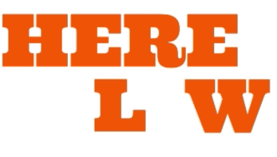
# 목차

1. [기획 배경](#기획-배경)
2. [서비스 소개](#서비스-소개)
8. [빌드 및 배포 가이드](#빌드-및-배포-가이드)
<!-- 4. [기술 스택](#기술-스택)
6. [서비스 설계](#서비스-설계)
7. [명세서](#명세서) -->

# 기획 배경

## 필요성
### 일반인을 위한 자동화된 법률 서비스의 필요성
- **법률 서비스는 그 중요성에 비해 이해하기 어렵습니다.**
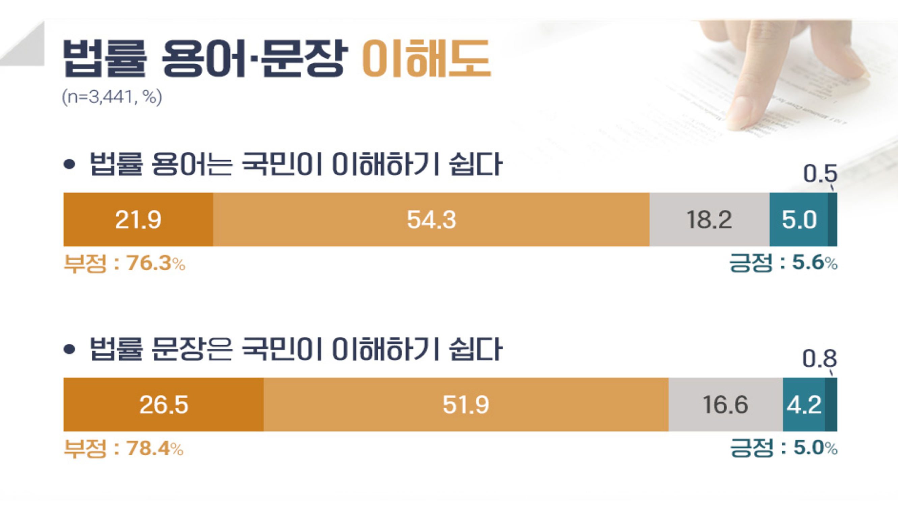
- **또한 재판 등 법적인 경험을 하는 비율도 적고, 관련 서비스의 질도 낮아 일반인이 접근하기 어렵습니다.**
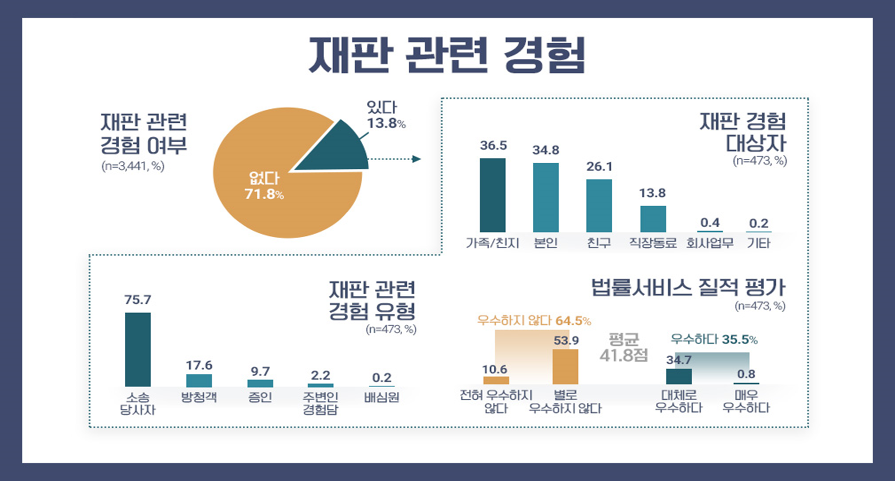

# 서비스 소개
## 여기로
- AI기반 판례 검색
  > 법률에 익숙하지 않은 일반인에게 [RAG](https://en.wikipedia.org/wiki/Retrieval-augmented_generation) 기반 AI 판례 검색을 제공합니다.
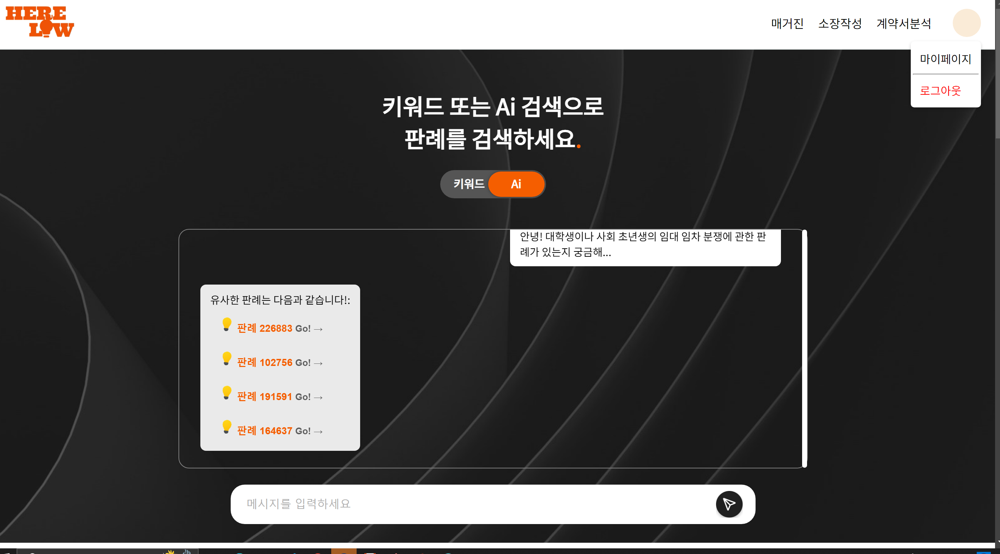

- 법령 패치노트
  > 매일매일의 법령 개정사항을 알 수 있습니다.
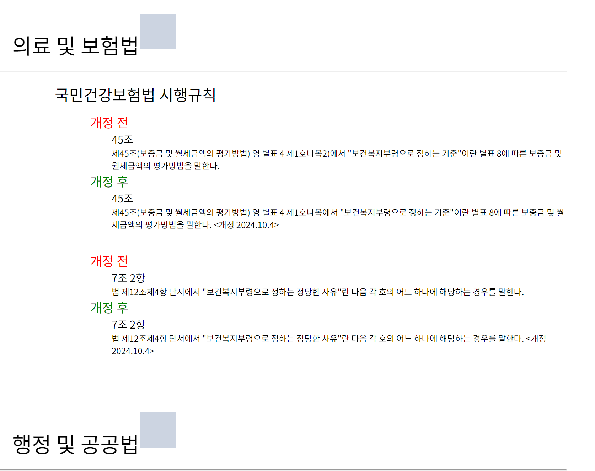

- 법령 매거진
  > 매일매일의 신규 법령 또는 법령 개정안(법령 패치노트) 에 대한 기사를 일반인이 이해하기 쉬운 언어로 자동 생성합니다.
  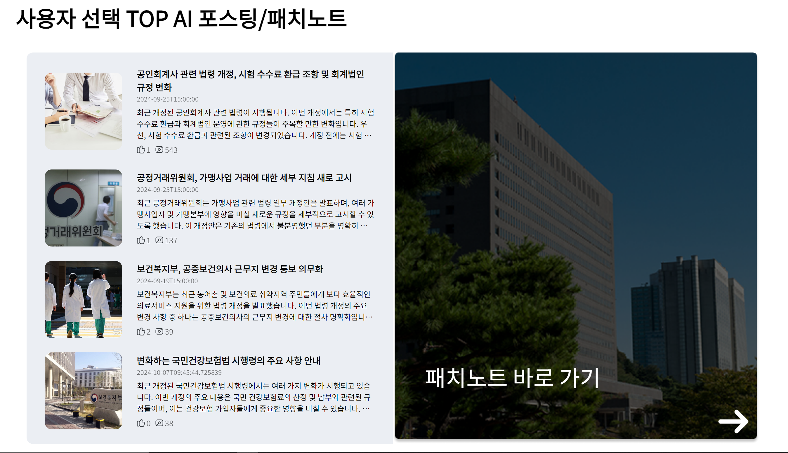

- AI 기반 법령 매거진 추천
  > [RAG](https://en.wikipedia.org/wiki/Retrieval-augmented_generation) 를 활용한 Content-based Recommendation 기술에 기반하여 유저 맞춤형으로 법령 매거진 기사를 추천합니다.
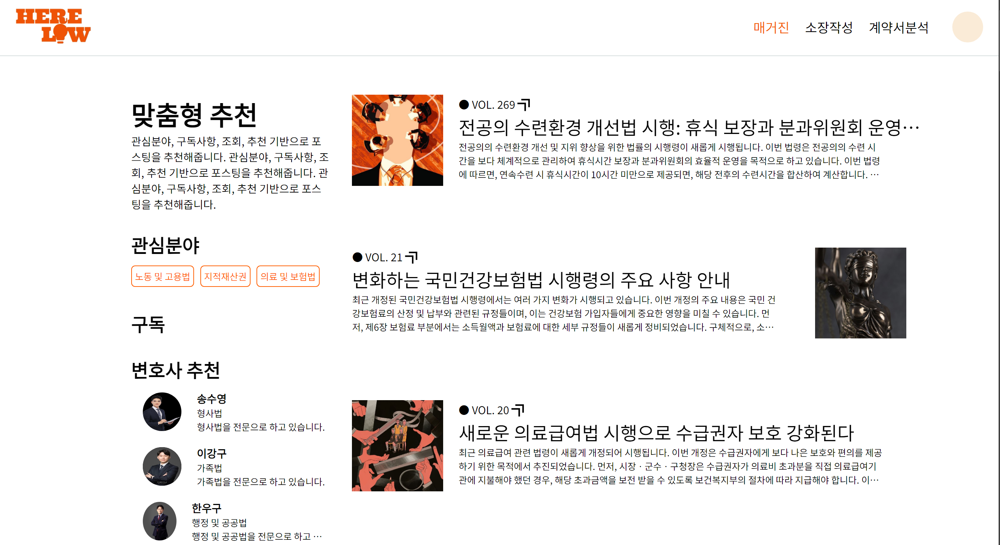
  
- 약관 및 조항 의 유불리 자동 분석
  > OCR을 통해 문서를 자동 인식한 후, 조항의 유불리를 분석해 줍니다.
  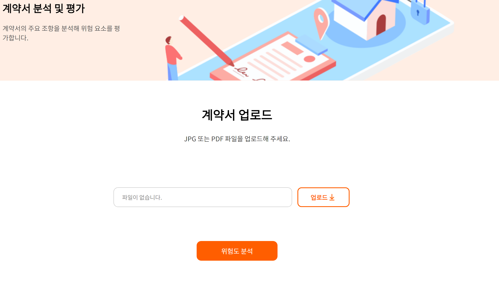
  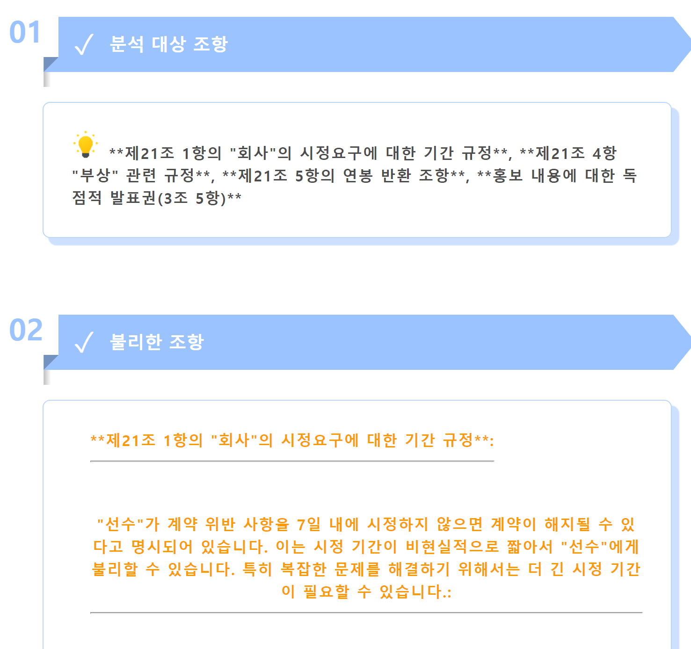
  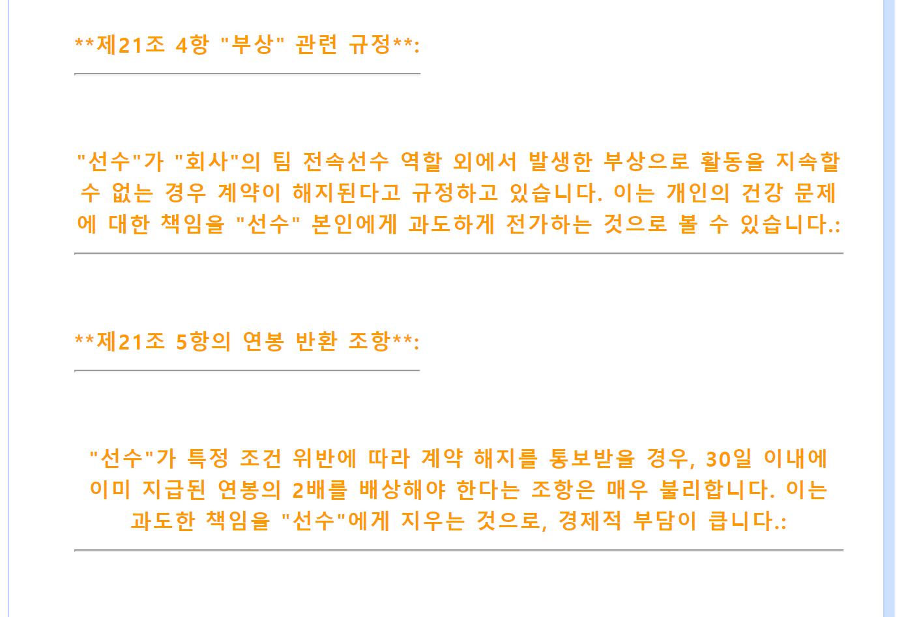
  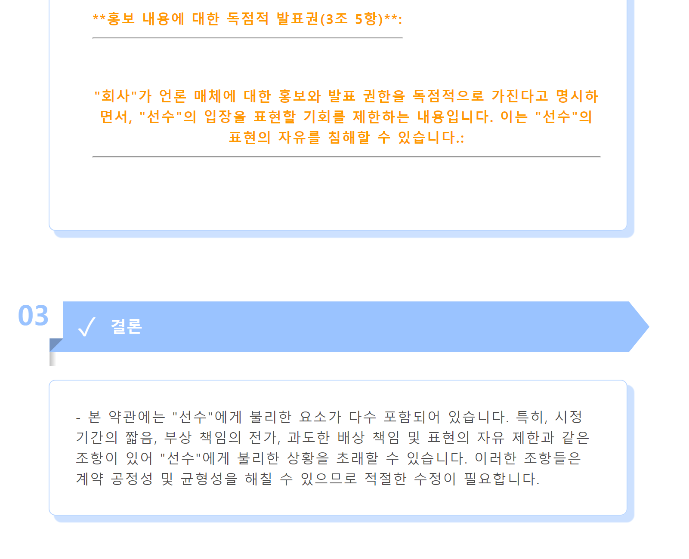

- 소장 자동 작성
  > 정보를 입력하면 소장을 자동으로 작성하여 줍니다.
  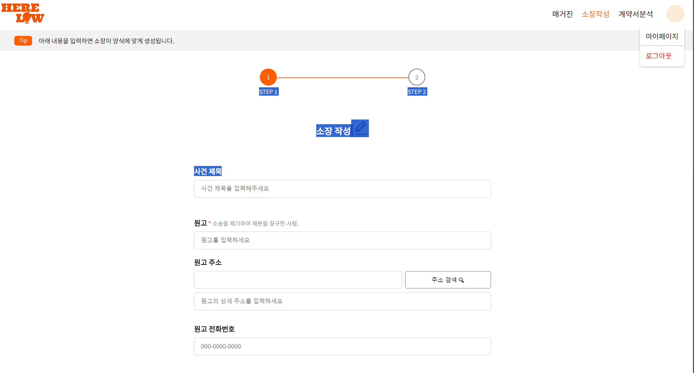
# 빌드 및 배포 가이드
- [Porting manual](exec/Porting_manual.md) 을 참조하세요.
- 자세한 사용법은 [시연 시나리오](exec/Scenario.md) 를 참조하세요
<!-- # 기술 스택

## Front-End

- React
- Bootstrap
- WebRTC
  실시간으로 WebSocket 연결 및 WebRTC 연결을 갱신하는 동적인 음성 대화 기능을 구현함

## Back-End

- FastAPI
- SpringBoot
- MySQL
- JPA

## AI

- Llama-CPp
- 자체 AI 모델
  - [HuggingFace](https://huggingface.co/) 및 [PyTorch](https://pytorch.org/)를 사용한 감정 인식 모델을 구현하고 Fine-Tuning 하였음
  - 모델은 유저의 발언을 입력으로 받아 [Russell's Model](https://en.wikipedia.org/wiki/Emotion_classification#Circumplex_model) 모델에 대한 감정 예측 X값과 Y값을 출력함
- 데이터셋 및 훈련 방법
  - 
  - 네이버 영화 리뷰 데이터를 수집하고 전처리(긍정도, X축)
  - 대화 데이터셋을 수집하여 전처리(각성도, Y축)
  - 총 약 16만 문장으로 러셀 척도에 대한 예측을 훈련시킴
    - 평균 오차(L1 Loss) 0.13 ~ 0.14
  - Layer-wise learning rate를 적용하여 Catastrophic forgetting을 최소화
    - HuggingFace의 Trainer Class를 상속한 Custom Trainer class로 구현

## 외부 API

- [OPENAI API](https://platform.openai.com/)
  - 챗봇 및 요약용 LLM 제공
- [CLOVA Speech](https://clova.ai/speech)
  - 음성 인식을 챗봇과의 대화에 활용 -->

<!-- # 서비스 설계
## 화면 설계서
[Figma link](https://www.figma.com/file/1PJbdnukSAbrktuaonSwqR)

## Flow chart
[Figma link](https://www.figma.com/file/fAxSiFc3f0PXwAZOsBEGxW)
### 메인 Flow chart

### AI챗 Flow chart

## 서비스 시퀀스
### AI 채팅 시퀀스

### 유저 간 채팅 시퀀스

## Architecture

## ERD

# 명세서
## 기능 명세서

## API 명세서

 -->

